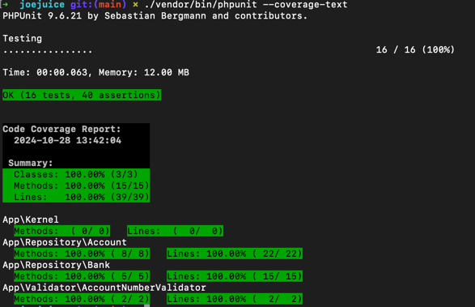

## Task: Bug correction and refactor

### Solution

* Wrapped the assignment into a symfony app, added the classes just as repositories.
* Rewrote the tests for PHPUnit
* Removed unnecessary classes and merged the methods into the 2 existing classes
* Rewrote and added some new methods to support transactions and a better transaction history

### Test results


### Install and Setup

Just pull repo, run `composer install` and then `bin/phpunit` to run tests. Use `bin/phpunit --coverage-text` if you have a coverage driver like xdebug available. 

Files are located in the `src` folder.

### Original description of the assignment
This file contains two classes which represents a bank and its bank accounts.
Both classes are very badly implemented following no standards and contains a lot of errors.

The Bank class represents a bank
The bank have these main features:
 - Has zero or more bank accounts
 - Must have an address.
 - Must have a name
 - Can perform a money transfer between accounts in the bank.
 - Can return a "Postal Address" created from the name of the bank and the address.

The Account class represents a bank account.
A bank account has these main features:
 - Must have a unique account_number
 - Knows its current balance
 - Knows its history of transactions (withdrawels and deposits)

After the two class implementations three crude tests has been written,
which currently all succeed with the current implementation

Please refactor classes, interfaces whatever needed and achieve the following:
 - Refactored classes should follow PSR-2 coding style guide
 - They should be robust and testable
 - All errors should be eliminated
 - The code should be sufficiently documented

You are allowed to do any kind of refactor including renaming classes, function, attributes or
introducing breaking changes etc, as long as the three tests continue to work.
If needed you are allowed to update the tests as well, if they no longer comply with your refactored code.

Have fun :)

```
interface BankInterface
{
    public function addBankAccount(Account $bankAccount):void;
    public function getBankAccounts(): array;
    public function getPostalAddress():string;
}

/**
 * AbstractTransactionService
 */
abstract class AbstractTransactionService
{
    /**
    * doInternalTransaction
    * Allow only transactions between accounts in same bank
    */
    public function doInternalTransaction(Account $fromAccount, Account $toAccount, float $amount):void
    {
        // match the 2 accounts in same bank and check balance to process transaction
        $accountCheck = 0;

        foreach ($this->getBankAccounts() as $bankAccount) {
            if ($bankAccount->getAccountNumber() == $fromAccount->getAccountNumber()) {
                $accountCheck++;
            }

            if ($bankAccount->getAccountNumber() == $toAccount->getAccountNumber()) {
                $accountCheck++;
            }

            if ($accountCheck == 2 && $fromAccount->getBalance() >= $amount) {
                $fromAccount->makeWithdrawal($amount);
                $toAccount->makeDeposit($amount);

                return;
            }
        }
    }
}

/**
 * Bank
 */
class Bank extends AbstractTransactionService implements BankInterface
{
    public $bankAccounts;

    public function __construct(private string $name, private string $address)
    {
        if (empty($name)) {
            throw new Exception('Bank creation fail: must have a name');
        }

        if (empty($address)) {
            throw new Exception('Bank creation fail: must have an address');
        }
    }

    public function addBankAccount(Account $bankAccount):void
    {
        $this->bankAccounts[] = $bankAccount;
    }

    public function getBankAccounts():array
    {
        return $this->bankAccounts;
    }

    public function getPostalAddress():string
    {
        return $this->name ."\n".$this->address;
    }
}

class AccountNumberValidator
{
    private static array $accountNumbers = [];

    // Store the account number after creation
    public static function addAccountNumber(string $accountNumber):void
    {
        self::$accountNumbers[] = $accountNumber;
    }

    // Check if the account number is unique and not empty
    public static function isUnique(string $accountNumber):bool
    {
        return !in_array($accountNumber, self::$accountNumbers) && !empty($accountNumber);
    }
}

interface AccountInterface
{
    public function makeDeposit(float $deposit):void;
    public function makeWithdrawal(float $withDrawal):void;
}

class Account implements AccountInterface
{
    private $deposits;
    private $withdrawals;

    public function __construct(private string $accountNumber, private float $balance)
    {
        if (AccountNumberValidator::isUnique($accountNumber)) {
            AccountNumberValidator::addAccountNumber($accountNumber);
        } else {
            throw new Exception('Account creation fail: account number already exist or is empty');
        }
    }

    public function getAccountNumber()
    {
        return $this->accountNumber;
    }

    public function makeDeposit(float $deposit):void
    {
        $this->deposits[] = $deposit;
        $this->balance += $deposit;
    }

    public function makeWithdrawal(float $withdrawal):void
    {
        $this->withdrawals[] = $withdrawal;
        $this->balance -= $withdrawal;
    }

    public function getWithdrawals():array
    {
        return $this->withdrawals;
    }

    public function getDeposits():array
    {
        return $this->deposits;
    }

    public function getBalance():float
    {
        return $this->balance;
    }
}

/*
 * Test 1:
 * Initialize a bank test generation of the postal address method
 *
 */
$bankName = 'JOE & THE BANK';
$bankAddress = 'Joe Street,\\nCopenhagen';
$bank = new Bank(name: $bankName, address: $bankAddress);
$bank2 = new Bank(name: 'CGD', address: 'viseu');

$postalAddress = $bank->getPostalAddress();
$expectedPostalAddress = $bankName . "\n" . $bankAddress;
if($expectedPostalAddress !== $postalAddress){
    echo "Failed to get Postal address\n";
    exit();
}

/*
 * Test 2:
 * Create two bank accounts and add them to a bank
 */
$firstAccountNumber = 'ab01';
$firstAccount = new Account(accountNumber: $firstAccountNumber, balance: 100);

$secondAccountNumber = 'qj42';
$secondAccount = new Account(accountNumber: $secondAccountNumber, balance: 0);

$bank->addBankAccount($firstAccount);
$bank->addBankAccount($secondAccount);

$number_of_accounts = count($bank->getBankAccounts());
$expected_number_of_accounts = 2;

if($expected_number_of_accounts !== $number_of_accounts){
    echo "Failed to assign accounts\n";
    exit();
}

/*
 * Test 3:
 * Transfer between accounts
 */
$bank->doInternalTransaction($firstAccount, $secondAccount, 10);
$bank->doInternalTransaction($firstAccount, $secondAccount, 3.55);
$bank->doInternalTransaction($firstAccount, $secondAccount, 10);
$bank->doInternalTransaction($secondAccount, $firstAccount, 20);

$number_of_withdrawels_in_first_account = count($firstAccount->getWithdrawals());
$expected_number_of_withdrawels_in_first_account = 3;
if($expected_number_of_withdrawels_in_first_account !== $number_of_withdrawels_in_first_account){
    echo "Failed to withdraw from first account\n";
    exit();
}

$number_of_deposits_in_second_account = count($secondAccount->getDeposits());
$expected_number_of_deposits_in_second_account = 3;
if($expected_number_of_deposits_in_second_account !== $number_of_deposits_in_second_account){
    echo "Failed to deposit to second account\n";
    exit();
}
// print_r($bank);
echo "All seems fine !\n";